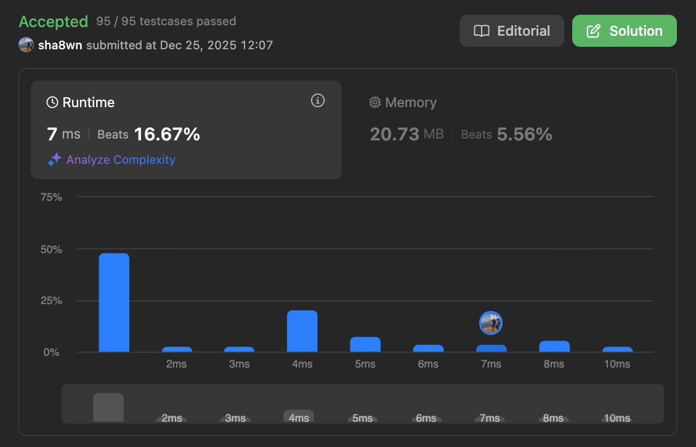
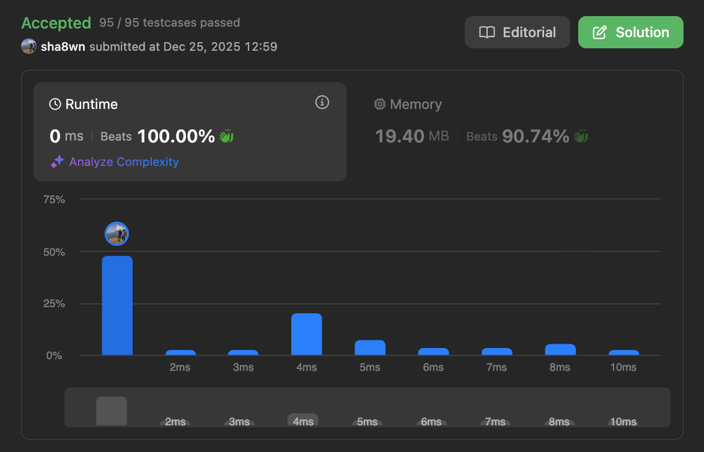

# Leetcode — Majority Element II (Swift)

This repository contains two Swift solutions for LeetCode 229: Majority Element II:

1. **Linear time, linear space** solution using a hashmap  
2. **Linear time, constant space** solution using the Boyer–Moore Voting Algorithm (extended for `n / 3`)

---

## Linear Time & Space Solution (HashMap)

The most straightforward approach is to count frequencies using a hashmap and return all elements that appear more than `⌊n / 3⌋` times.

This solution:
- Runs in **O(n)** time
- Uses **O(n)** space
- Is simple, readable, and sufficient for passing the problem on Leetcode

---

## Constant Space Solution (Boyer–Moore Voting Algorithm)

The constant space solution is based on the **Boyer–Moore Voting Algorithm**, well explained in  
[NeetCode’s video](https://www.youtube.com/watch?v=Eua-UrQ_ANo).

While the logic behind the hashmap can seem difficult to grasp, it is the right way to go to scale this solution from `n/3` to `n/k`.

To make this easier to understand and for interviews, it might be worth while tracking 2 variables than using a hashmap. The main intuition to remember is that for `n/3`, there can never be more than 2 majority elements.

Updating the solution shows a big improvement in the space used.

### Why is this considered constant space?

A common question is:

> “If we’re tracking counts, why is this O(1) space?”

Because:
- The number of tracked elements is **fixed**
- It does **not grow with input size**
- For `n / 3`, we only ever track **2 candidates**

This is also why this approach generalizes cleanly to `n / k`:
- Track `k - 1` candidates
- Space remains **O(k)**, which is constant with respect to `n`

Using explicit variables instead of a hashmap often makes this clearer and more intuitive in interviews.

